# [PYTORCH] Attention Networks for Document Classification

## Introduction

Pytorch implementation of the paper **Hierarchical Attention Networks for Document Classification** [paper](https://www.cs.cmu.edu/%7Ediyiy/docs/naacl16.pdf). 

## Requirements:

* **python 3.6**
* **pytorch 0.4**
* **tensorboard**
* **tensorboardX** (This library could be skipped if you do not use SummaryWriter)
* **numpy**

## Custom Dockerfile to build the Pytorch environment training on Valohai

## Datasets:

| Dataset                | Classes | Train samples | Test samples |
|------------------------|:---------:|:---------------:|:--------------:|
| AG’s News              |    4    |    120 000    |     7 600    |
| Sogou News             |    5    |    450 000    |    60 000    |
| DBPedia                |    14   |    560 000    |    70 000    |
| Yelp Review Polarity   |    2    |    560 000    |    38 000    |
| Yelp Review Full       |    5    |    650 000    |    50 000    |
| Yahoo! Answers         |    10   |   1 400 000   |    60 000    |
| Amazon Review Full     |    5    |   3 000 000   |    650 000   |
| Amazon Review Polarity |    2    |   3 600 000   |    400 000   |

## Training on Valohai platform with Machine learning version control

* Valohai.yaml 
* Experiments on Valohai platform with Version control

## Experiments:

Each experiment is run over 10 epochs.

| GLOVE word2vec|        50      |      100     |      200     |      300     |
|:---------------:|:------------------:|:------------------:|:------------------:|:------------------:|
|    ag_news    |   updated soon   |   updated soon   |   updated soon   |   updated soon   |
|   sogu_news   |   updated soon   |   updated soon   |   updated soon   |   updated soon   |
|    db_pedia   |   updated soon   |   updated soon   |   updated soon   |   updated soon   |
| yelp_polarity |   updated soon   |   updated soon   |   updated soon   |   updated soon   |
|  yelp_review  |   updated soon   |   updated soon   |   updated soon   |   updated soon   |
|  yahoo_answer |   updated soon   |   updated soon   |   updated soon   |   updated soon   |
| amazon_review |   updated soon   |   updated soon   |   updated soon   |   updated soon   |
|amazon_polarity|   updated soon   |   updated soon   |   updated soon   |   updated soon   |

The training/test loss/accuracy curves for each dataset's experiments (with the order from left to right, top to bottom is 50d, 100d, 200d and 300d word2vec) are shown below:

- **ag_news**

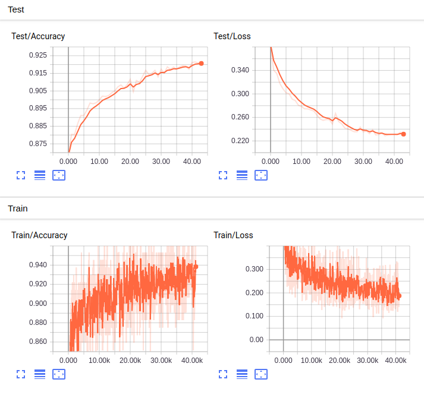 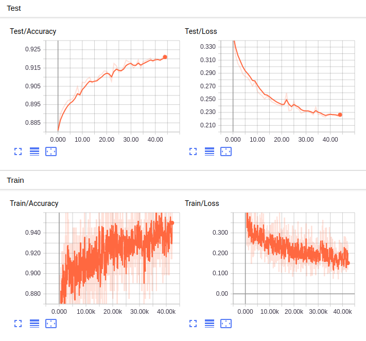 
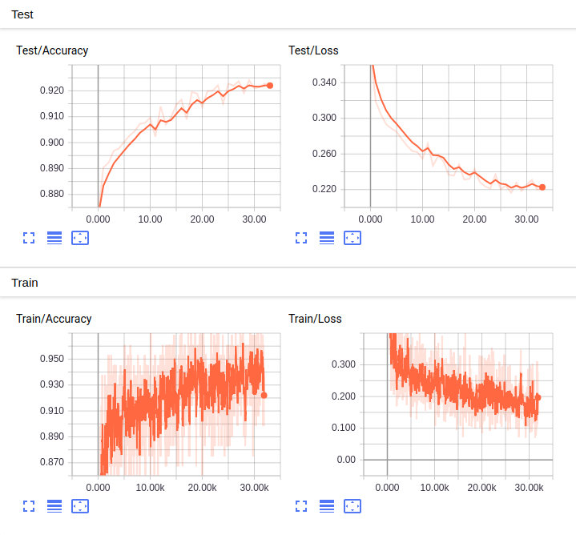 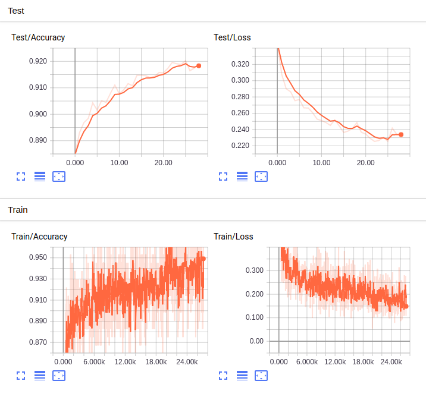

- **db_pedia**

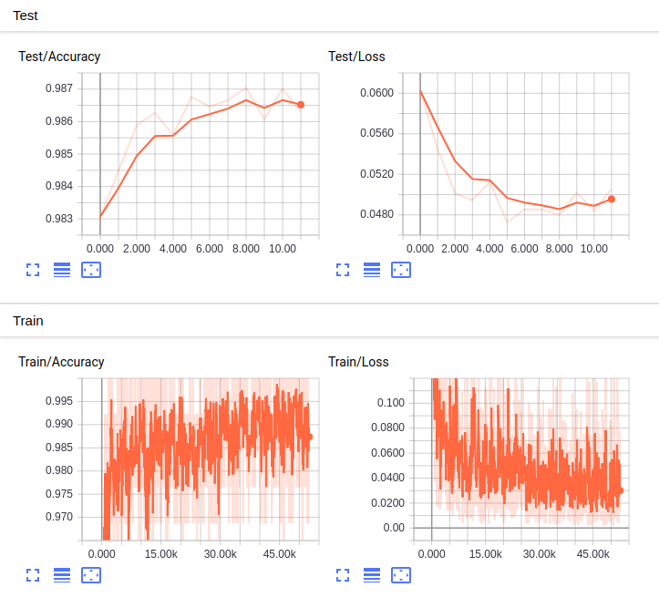 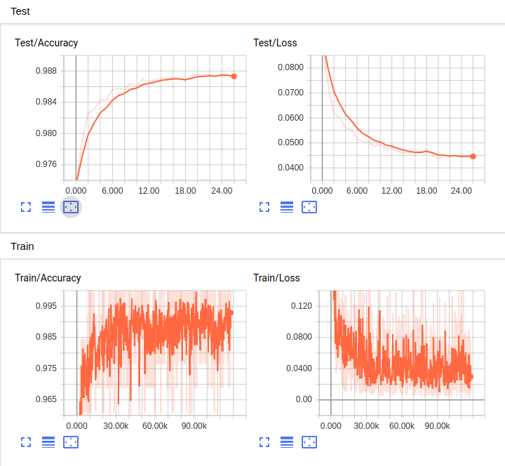 
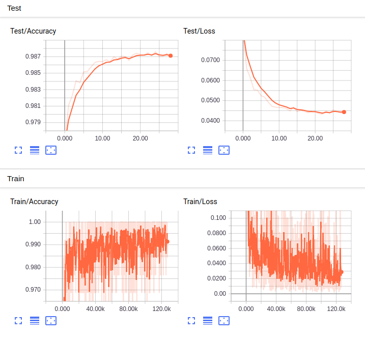 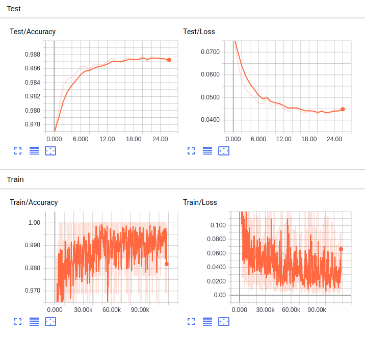

- **yelp_polarity**

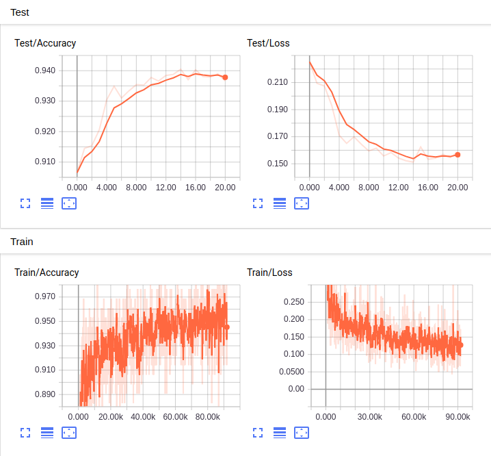 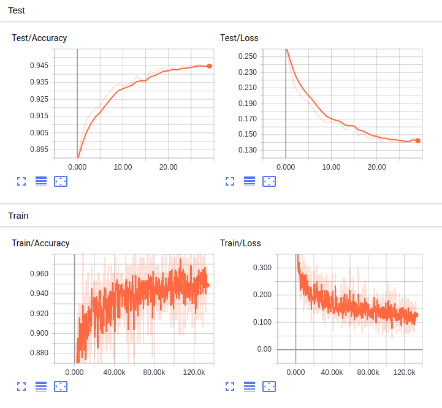 
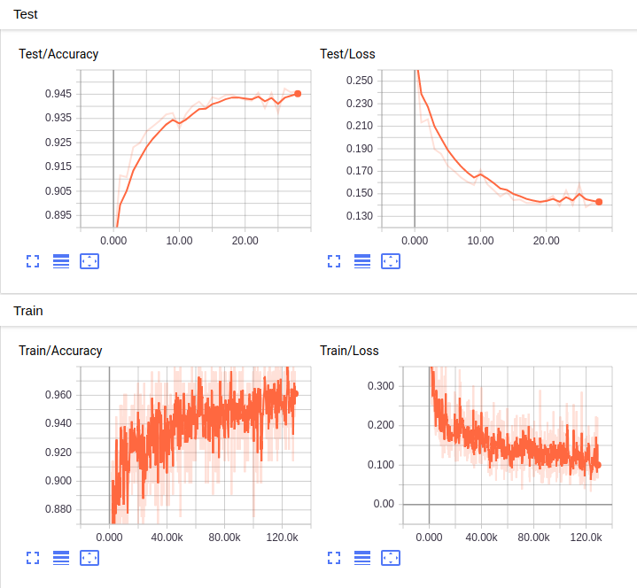 

- **yelp_review**

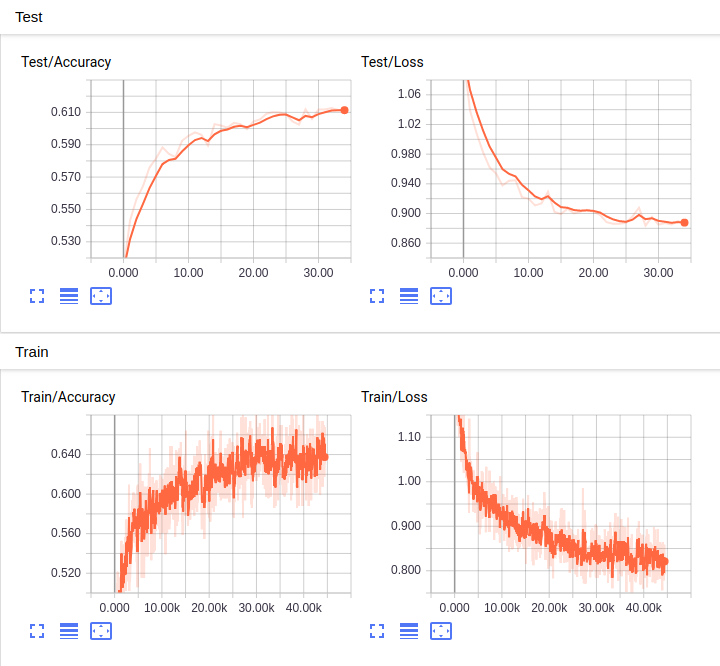  
 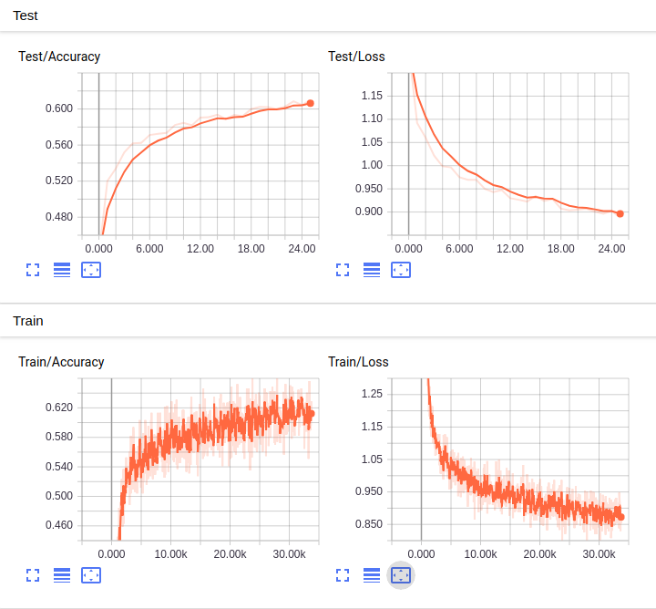

- **Yahoo! Answers**

 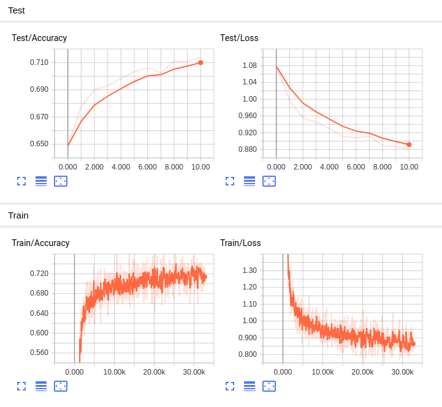 
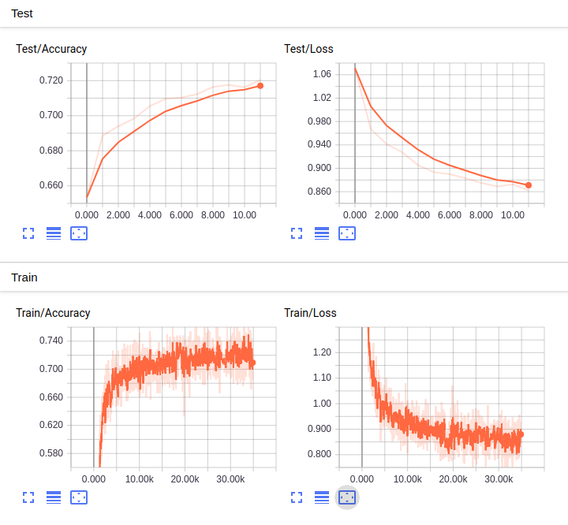 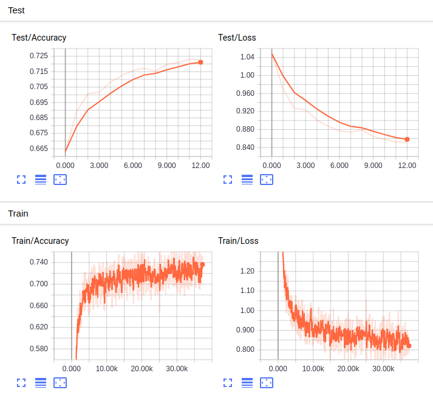

- **amazon_review**

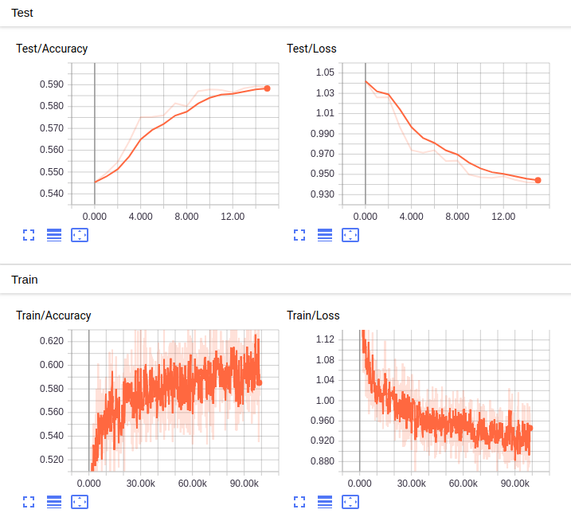  
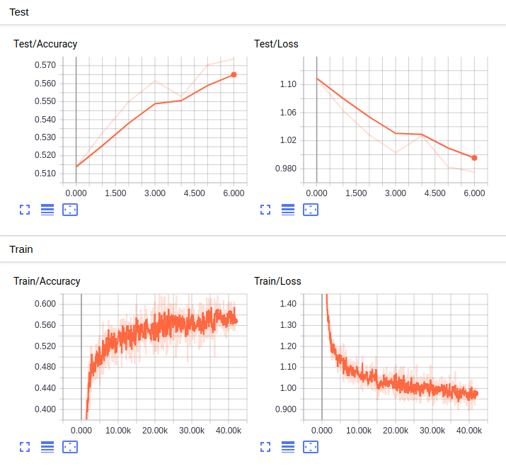 

- **amazon_polarity**

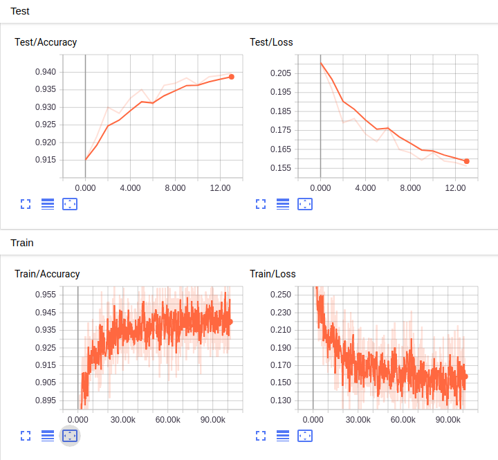 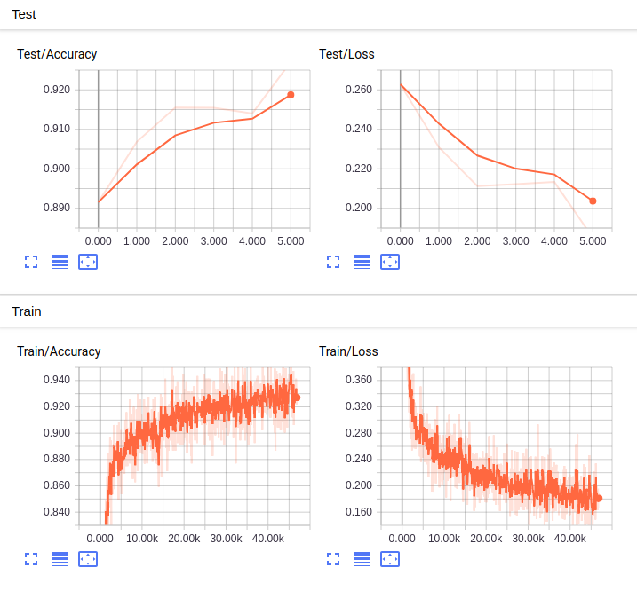 
 

